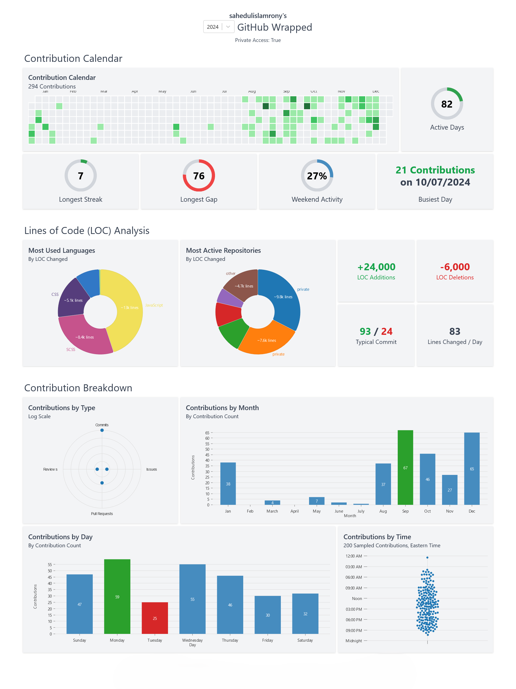

  
<!-- 
 -->
<!-- 

 -->
<!--    -->
<h2 align="left"> 💫 About </h2>

I am a **CSE undergraduate** at **Jashore University of Science and Technology -** [**JUST**](https://just.edu.bd) with a passion for **Software Development**, **Artificial Intelligence** , and **Machine learning**. I enjoy building innovative and impactful applications. I'm highly interested in mastering **advanced programming concepts** and exploring cutting-edge technologies to push the boundaries of innovation.

<h2 align="left"> ⚡Tech Stack </h2>

 
 

 
 

 
<h2 align="left"> 🔭 Languages and Tools I'm interested in</h2>

  
  
  
  
  
  
  
  
  
  
  
  
  
  
  
  
  
  
  
  
  

 
<h2 align="left"> 🔥My Github Activities  in 2024 </h2>

 

<h2 align="left">  Connect with me</h2>

  
  
  
  
 
</a>

 

 

- 🌱 I’m currently learning **NEXT.js , Java**

- 💬 Ask me about **Html, CSS, Tailwind, JavaScript, React**

- 📫 How to reach me **<cast.sahedul@gmail.com>**

- 📄 Know about my experiences [**Resume**](resources/Resume.pdf)

- ⚡ Fun fact 👉 **I am not a Robot 🤖**

 

## Sponsored

<!-- GitAds-Verify: 8A7S1W3N4Q5MNX939M9EJWH9WO91ETMS -->
